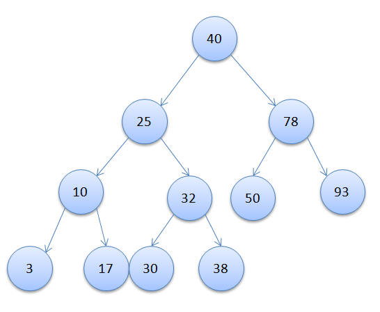

# Binary Search Tree (BST)

Binary Search Trees are sorted/ordered collections of data represented as a tree structure as shown in the image below. Each _node_ of a BST must adhere to the BST properties listed [below](#BST Properties)



## BST properties

- Each BST has 1 **root**, in the image above the root node has a value of 40.
- A given node may have **up to two** child nodes.
- The bottom most nodes are known as leaves, a node is a leaf if it has no child nodes. For example, there are 5 leaf nodes in the diagram above; _3, 17, 30, 38, 93_
- BSTs are sorted by nature, this means that for a given node, its left child node is guaranteed to be less than or equal to itself.
- For any given node, the value of its right child node is guaranteed to be greater than itself
- For any given node, its child nodes must also adhere to the BST properties documented above

## BST methods

The common methods that are typically implemented for this data structure are the following:

- **insert**: used for inserting new data in an ordered fashion into the tree
- **find**: this performs a search on the tree to see if a specified value exists
- **remove**: this deletes a specified value from the tree

## BST signature

```javascript
class BST {
  constructor(val) {
    this.value = val;

    // the following store the left and right nodes of the given BST node
    this.left = null;
    this.right = null;
  }

  /**
   *
   * @param {number} val
   */
  insert(val) {
    // logic
  }

  /**
   *
   * @param {number} val
   * @returns {boolean}
   */
  find(val) {
    // logic
  }

  /**
   *
   * @param {number} val
   */
  remove(val) {
    // logic
  }
}
```

## Implementation

The implementation of the BST has been done in `bst-iterative.js` and `bst-recursive.js`. There are two solutions(iterative and recursive) for the BST methods since they are abstract data types, hence the solutions have different space-time complexities.
